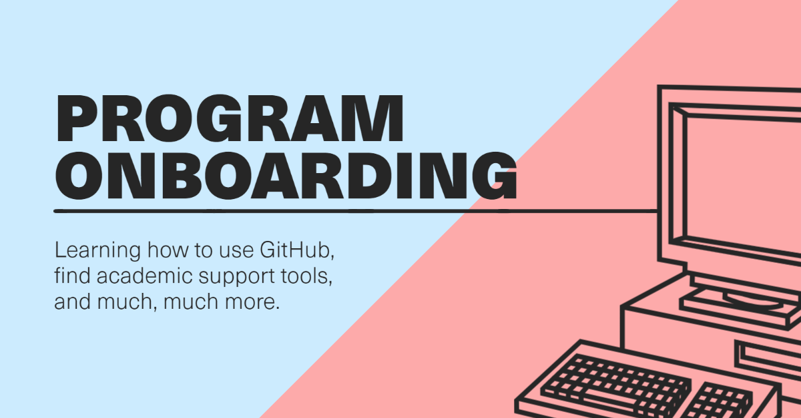

# GitHub and Other Onboarding for Students
> Training modules, cheatsheets, and more!

This is your checklist for getting ready to use GitHub in the Applied Computing program. It also contains a fairly large collection of resources for other topics like various programming languages we use, how to research, and more. This document is *a work-in-progress* and will be updated fairly regularly. Your feedback and participation in the development of this document is encouraged, as well! Feel free to fork and do a **pull request** (PR) and add resources you feel are useful.

## GitHub

Initial steps:

1. [Sign up for GitHub Education](https://education.github.com/students) and get your Student Pack
2. Download and install GitHub Desktop (or get wild and try something like [GitKraken](gitkraken.com), Dr Straight's IDE of choice)
3. Contact one of your faculty to be added to this organization (don't forget to include your GitHub username)
4. ...
5. Profit!

### Beginner

+ [Introduction to GitHub | GitHub Learning Lab](https://lab.github.com/githubtraining/introduction-to-github)
+ [First Day on GitHub | GitHub Learning Lab](https://lab.github.com/githubtraining/first-day-on-github)
+ [GitHub Pages | GitHub Learning Lab](https://lab.github.com/githubtraining/github-pages)
+ [Uploading your project to GitHub | GitHub Learning Lab](https://lab.github.com/githubtraining/uploading-your-project-to-github)

### Intermediate

+ [Reviewing pull requests | GitHub Learning Lab](https://lab.github.com/githubtraining/reviewing-pull-requests)
+ [Managing merge conflicts | GitHub Learning Lab](https://lab.github.com/githubtraining/managing-merge-conflicts)
+ [Create a release based workflow | GitHub Learning Lab](https://lab.github.com/githubtraining/create-a-release-based-workflow)

### Advanced

+ [Securing your workflows | GitHub Learning Lab](https://lab.github.com/githubtraining/securing-your-workflows)
+ [GitHub Actions: Hello World | GitHub Learning Lab](https://lab.github.com/githubtraining/github-actions:-hello-world)
+ [Getting started with GitHub Apps | GitHub Learning Lab](https://lab.github.com/githubtraining/getting-started-with-github-apps)

## R

You'll be using R at least in APCV 302 and APCV 362, but once you appreciate just how powerful RMarkdown is, you'll probably want to use it for a lot more. 

+ [An Introduction to R](https://intro2r.com/)
+ [R Markdown: The Definitive Guide](https://bookdown.org/yihui/rmarkdown/)
+ See [Dr. Straight's giant list of R-related resources](https://github.com/ryanstraight/resources#r). 

## Student Learning Portfolio options

In Applied Computing, you'll be creating a portfolio that is public-facing and highlights some of your favorite and best work. Here are some guides for options to get your portfolio online.

+ [Up & running with blogdown in 2021 | Alison Hill](https://alison.rbind.io/blog/2020-12-new-year-new-blogdown/)
    + Note: you can use either GitHub Pages or Netlify.

# Academic Success Resources

This section comes from [Dr Straight's resources](https://github.com/ryanstraight) that he shares with his classes.

## Research

+ [UA Library's research guides](https://libguides.library.arizona.edu/)
    + Covers virtually every topic at the university.
+ [Finding a Topic and Beginning Research](https://www.cs.umd.edu/~oleary/gradstudy/node9.html)
    + A guide from Dr. Dianne P. O'Leary at the University of Maryland. Quite good.
+ [How To Do Graduate-Level Research: Some Advice](https://www.ece.rutgers.edu/~cps/assets/extras/HowToDoResearch_ANRG_WP02001.pdf)
    + Specifically, see section 3 (p. 7), "The Craft of Research---Basic Skills." Good for undergraduates to sink their teeth in, too. Don't let the "graduate-level research" bit throw you off. This is great advice for undergraduates, as well.
+ [Discovering Statistics](https://www.discoveringstatistics.com/)
    + Yes, it's focus is statistics but it's an incredibly useful resource. Great assistance with graduate-level work, though it's no replacement for a methods course. Even at the undergraduate level it is *very* useful.

## Writing

+ [Purdue's Online Writing Lab (OWL)](https://owl.purdue.edu/owl/research_and_citation/apa_style/apa_style_introduction.html)
    + Bookmark this. Get to know it. Shower it with affection. This will likely be your best friend in university.
+ [Microsoft Word APA template](https://drive.google.com/open?id=0B4hpwxw-Lsr4U2lWVG45TkdKSDQ)
    + You're highly encouraged to use the `papaja` R package but, barring that, this is a great way to make sure you're actually following the required style guide, especially if you've never done it before. Of course, I would suggest you try using an [automated process](https://www.chronicle.com/blogs/profhacker/using-rstudio-for-apa-style-and-more/65486) that lets you focus on the quality of your *content* and less on how it *looks*.
+ [Reverse dictionary](http://www.onelook.com/reverse-dictionary.shtml)
    + Incredibly handy little tool, this. For when you *just can't think* of the right word or concept. From the website: "This tool lets you describe a concept and get back a list of words and phrases related to that concept. Your description can be anything at all: a single word, a few words, or even a whole sentence. Type in your description and hit Enter (or select a word that shows up in the autocomplete preview) to see the related words."
+ [The De-Jargonizer](http://scienceandpublic.com/)
    + Shows you just how accessible your writing is in terms of scientific jargon.
+ [Writing a Literature Review](http://libguides.bc.edu/litreview/gettingstarted)
    + The literature review is intended to be a comprehensive look at the literature on a particular topic. Writing one can be devilishly difficult. Here is a guide.
+ [Writing a paper with Citavi](https://drive.google.com/open?id=0BwUSv3c2G0pAV1R0SkxFUDlnekE)
    + In case you go down the Citavi rabbithole.
+ [Zotero](https://www.zotero.org/) and [Better BibTeX for Zotero](https://retorque.re/zotero-better-bibtex/)
    + Zotero is my go-to citation manager and Better BibTeX makes using it while writing in RMarkdown a breeze. Combined with `papaja`, it ensures perfectly formatted references and citations.
+ [Avoid plagiarism | University of Arizona Libraries](https://new.library.arizona.edu/research/citing/plagiarism)
    + Using a citation management system like the ones below can go a *very* long way to preventing this. A very important read.

## Tutoring

The University provides free tutoring for writing and math, and various other related subjects, at multiple locations and fully online. Students can access free tutoring in-person at the Cochise and Yuma County locations, at the UA Think Tank in Tucson, as well as fully online from the UA Think Tank.

To find tutoring hours and availability near you, please select your location below to find the tutoring available at your learning center.

+ [Sierra Vista & Douglas: http://www.cochise.edu/academic-support/tutoring/](http://www.cochise.edu/academic-support/tutoring/)
+ [Tucson: http://thinktank.arizona.edu/](http://thinktank.arizona.edu/)
+ [Yuma: https://www.azwestern.edu/student-success-center/tutoring](https://www.azwestern.edu/student-success-center/tutoring)
+ [Arizona Western College: https://www.azwestern.edu/student-success-center/about-us](https://www.azwestern.edu/student-success-center/about-us)
+ [All Locations (Online): http://thinktank.arizona.edu/online-tutoring](http://thinktank.arizona.edu/online-tutoring)

## Databases

+ [Google Scholar](https://libguides.library.arizona.edu/googlescholar)
    + A quick resource. Good for getting an overview. Certainly is not a replacement for some of the more specialized databases (see below).
+ [Academic Search Ultimate](https://libguides.library.arizona.edu/academicsearchelite)
    + Great way to search lots of social sciences research. Filters are your friend. Lots of peer reviewed journals and will likely serve as your source for much of the foundational theory and core research. Tip: pay attention to suggested readings after finding an article that's very well suited to your search.
+ [ERIC](https://libguides.library.arizona.edu/eric_ebsco)
    + Educational Resources Information Center. Sponsored by the Department of Education. Focus is on pedagogy and education in general, not technology (though it may be included).
+ [LearnTechLib](https://libguides.library.arizona.edu/editlib)
    + Formerly EdITLib. Contains a considerable amount of research from technology-focused conference proceedings, journals, and eBooks. Great place to find niche research.
+ [CrossRef](http://www.crossref.org/)
    + Found the perfect article and want to see what's cited it and progressed the research? This is your best friend.
+ [Scopus](https://libguides.library.arizona.edu/scopus)
    + Much like CrossRef but I've had better results with it.

## Software

+ [UA Library's Citation Tools Overview](http://new.library.arizona.edu/research/citing/manage)
    + The library put together a brief page with descriptions and a comparison of the various citation mangement choices. It's worth a look.
+ [Citavi](https://www.citavi.com/en/individuals#academic)
    + I love Citavi and really wish I could get into it more than I do. Maybe it'll work for you. It's *very* in-depth.
+ [EndNote Online](http://libguides.library.arizona.edu/c.php?g=122873&p=802708)
    + I believe EndNote is the library's citation mangement software of choice. 
+ [Zotero](https://www.zotero.org/)
    + Another very popular (and now my service of choice) citation and reference management system.
+ [Mendeley](https://www.mendeley.com)
    + My (former) citation software of choice and I've tried *a lot* of them. Downside (if this bothers you): it was purchased by Eselvier.
